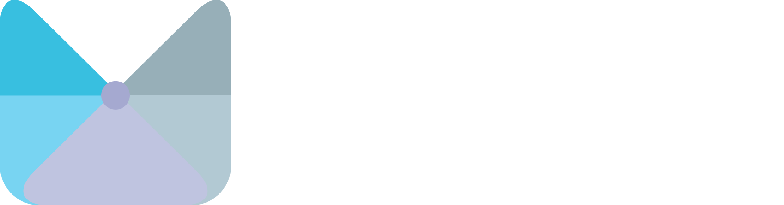

    

## Apps

### [Gloom](https://github.com/MateriiApps/Gloom)
A Material You GitHub Mobile client.

### [Upvote](https://github.com/MateriiApps/Upvote) \[WIP]
A customizable Reddit client, unbound by the API.

### [OpenCord](https://github.com/MateriiApps/OpenCord) \[WIP]
An open-source Material You implementation of the Discord Android app.

### [Dimett](https://github.com/MateriiApps/Dimett) \[WIP]
Material You Mastodon/Akkoma/Pleroma client.

## Libraries

- [partial-kt](https://github.com/MateriiApps/partial-kt) – Kotlin KSP plugin for generating partial class variants
- [panels](https://github.com/MateriiApps/panels) – M3 Discord-like compose panels
- \[WIP] [compose-custom-tabs](https://github.com/MateriiApps/compose-custom-tabs) – M3 Chrome custom tabs
